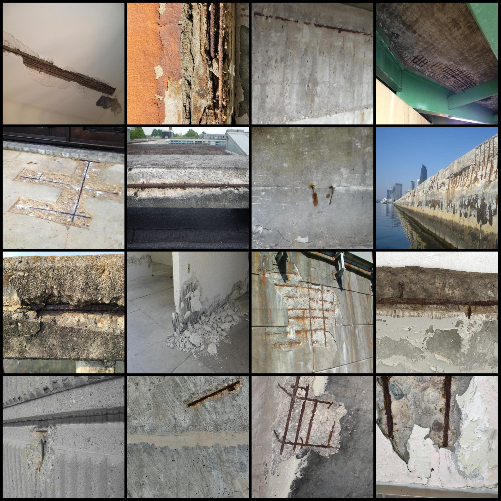
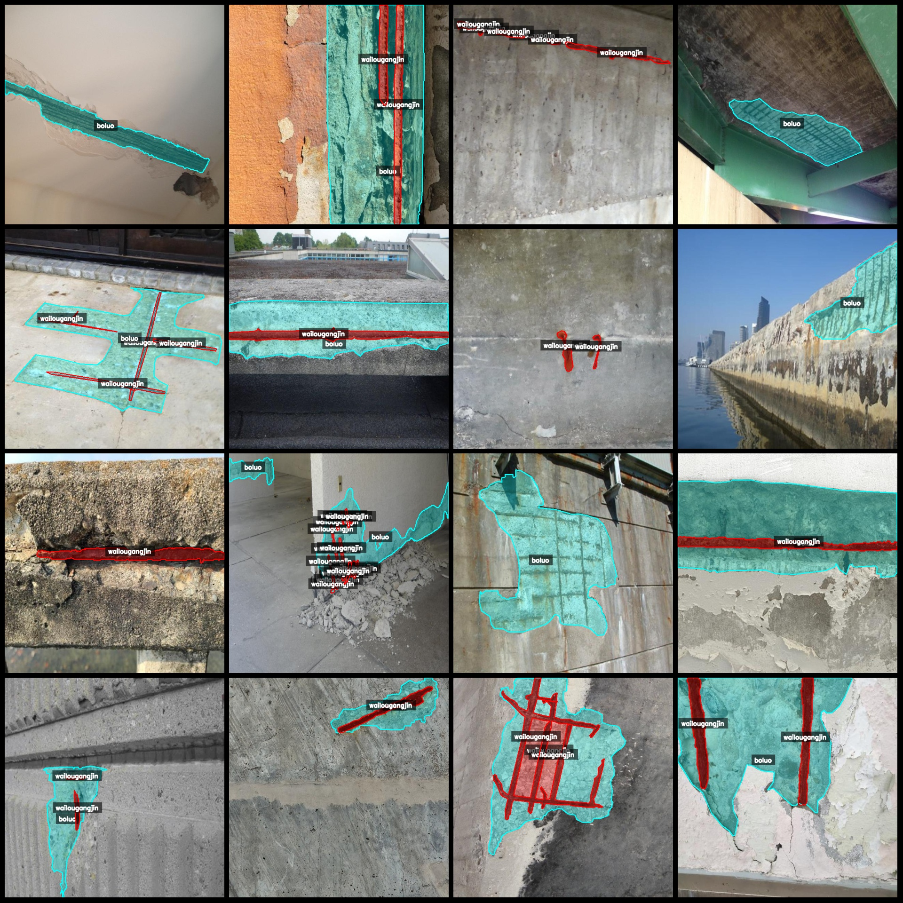
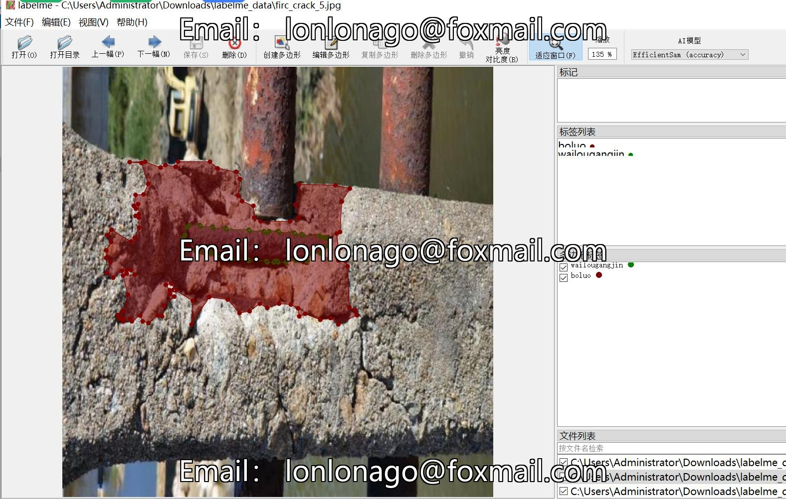

# Concrete Wall Delamination and Exposed Rebar Detection Data Set - LabelMe Format, 1199 Images in 2 Categories

Dataset format: LabelMe format (without mask files, only containing jpg images and corresponding json files)
Image count: Number of jpg files = 1199
Annotation count: Number of json files = 1199
Number of categories: 2
Category names: ["boluo", "wailougangjin"]
Number of boxes per category:
- Boluo (Delamination): Count = 1237
- Wailougangjin (Exposed Rebar): Count = 3588
Total number of boxes: 4825

Annotation tools used: LabelMe = 5.5.0
Image resolution: 640x640
Annotation rules: Polygons are drawn around the category labels

Important Note: You can use this dataset to edit with LabelMe, but you need to convert the json dataset into a mask or Yolo format or COCO format for semantic segmentation or instance segmentation.

Special Disclaimer: This dataset does not guarantee the accuracy of the trained models or weight files.

Image preview:

Annotation example:

Randomly selected 16 images:

Annotation drawing results:

LabelMe editing image example:

## Picture

Here is a pay link on Stripe ( https://buy.stripe.com/3cs8yP7sY87d0vu9AB ). Please contact me lonlonago@foxmail.com after funding $89, and I will send you a complete data files , thank you!

